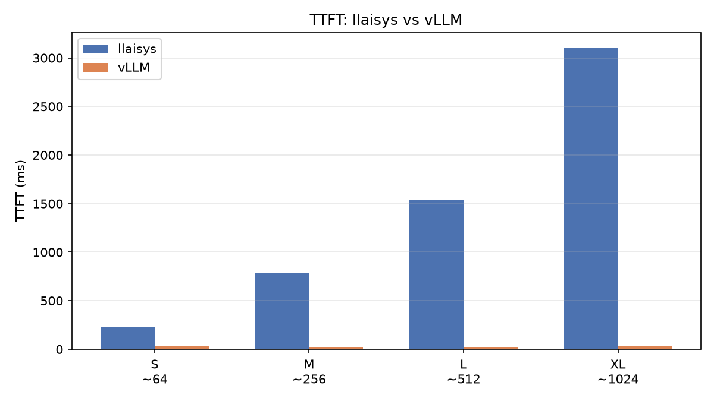
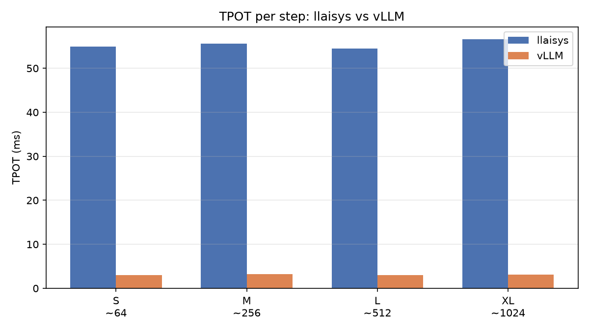
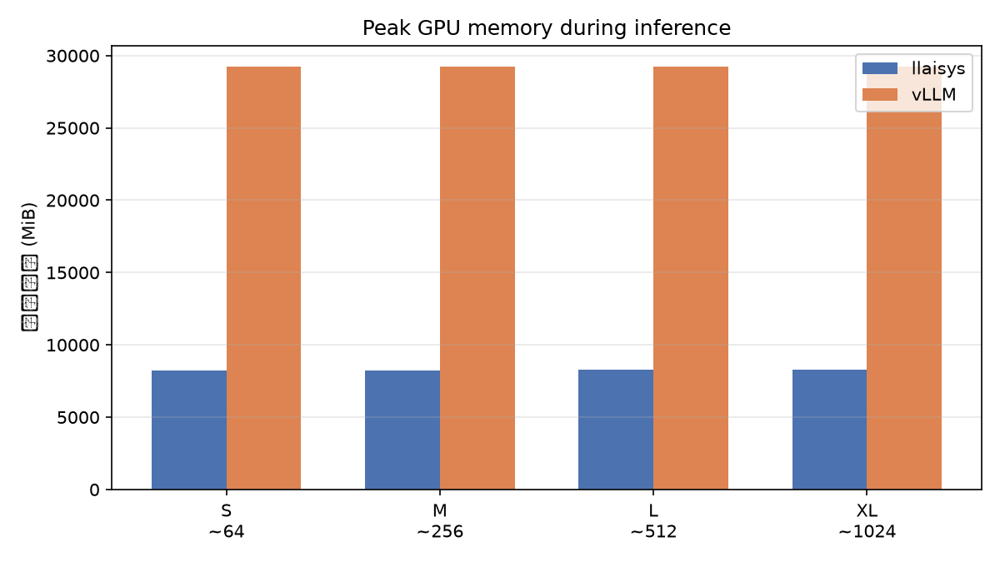
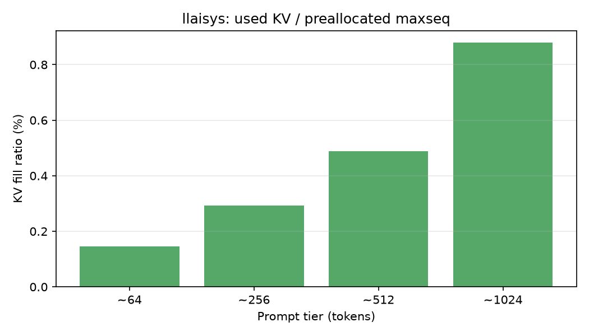
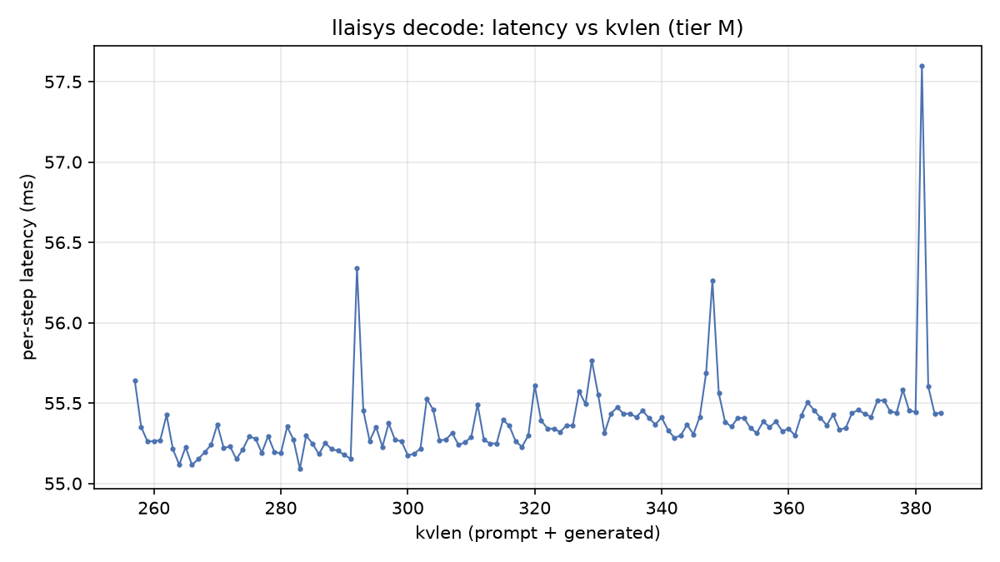
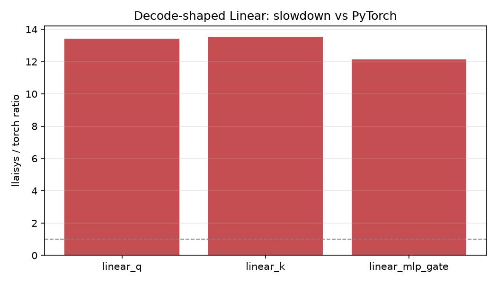
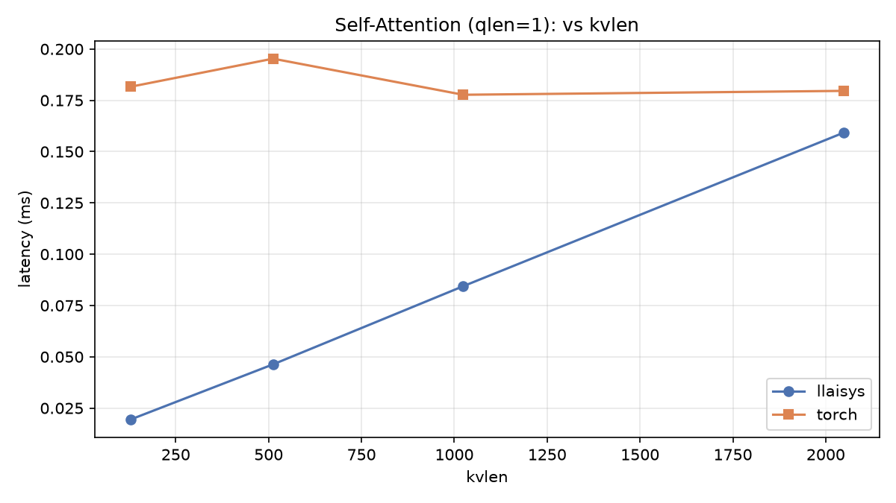
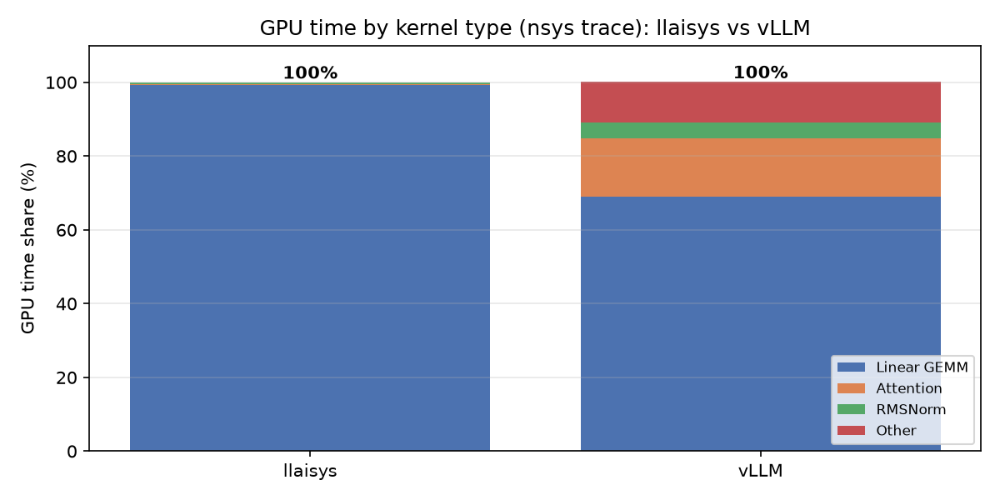
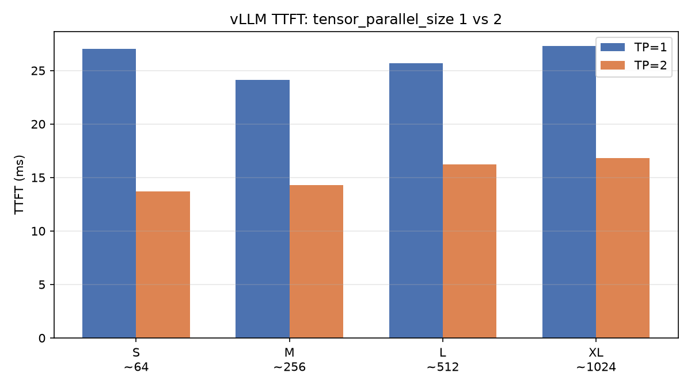

# llaisys Profiling 报告（RTX 5090）

> 生成时间：2026-09-02 11:50  
> Git：`cda0791`  
> GPU：`NVIDIA GeForce RTX 5090`  
> 模型：`/home/lcpu/39112061/ai-infra/models/DeepSeek-R1-Distill-Qwen-1.5B`

## 1. 实验目的

在 **同一模型、同一 GPU、同一套中文 prompt** 下，对比：

- **llaisys**（教学版 runtime + 朴素算子）
- **vLLM**（工业级推理引擎，作数量级参照）

**不是**公平引擎对决：vLLM 含融合 kernel、Paged KV、高度优化的 GEMM；llaisys 无分页 KV、无 Tensor Core GEMM。  
本报告回答：**慢多少、慢在哪、内存浪费在哪**。

## 2. 实验配置

| 项 | 值 |
|----|-----|
| Prompt 档位 | S/M/L/XL ≈ 64 / 256 / 512 / 1024 tokens（chat template 后） |
| Decode 步数 | 128（greedy / argmax） |
| 重复次数 | 3（报告取**中位数**，抗 GPU 功率/时钟状态噪声） |
| vLLM max_model_len | 4096 |
| dtype | BF16 |

> **测量口径**：llaisys 的 `Infer` 是连续生成契约（内部维护 KV cache 位置），
> profiling 脚本在每个独立 repeat 前显式 `ResetCache`，否则新 prompt 长于上一序列时会只算增量、低估 TTFT
> （已修复并复测）。部分 repeat 出现 ~10× 的 prefill 尖峰，源于 GPU 空闲降频/功率竞争，
> 故统计量取中位数而非均值。vLLM 侧用独立请求，Paged KV 天然每次重置，无此问题。

## 3. 端到端：TTFT

TTFT = 首词元延迟，主要反映 **prefill** 成本。

| 档位 | llaisys | vLLM | 倍数 (llaisys/vLLM) |
|------|---------|------|---------------------|
| S (~64) | 228.0 | 27.0 | 8.4x |
| M (~256) | 786.4 | 24.1 | 32.7x |
| L (~512) | 1537.1 | 25.7 | 59.9x |
| XL (~1024) | 3107.9 | 27.3 | 114.0x |

## 4. 端到端：TPOT

TPOT = decode 阶段每步平均延迟（llaisys 为逐步实测；vLLM 由总时长估算）。

| 档位 | llaisys | vLLM | 倍数 (llaisys/vLLM) |
|------|---------|------|---------------------|
| S (~64) | 54.9 | 3.0 | 18.5x |
| M (~256) | 55.6 | 3.3 | 17.0x |
| L (~512) | 54.5 | 3.0 | 18.3x |
| XL (~1024) | 56.6 | 3.1 | 18.0x |

## 5. 显存与 KV Cache

| 项 | 数值 |
|----|------|
| 权重文件 (safetensors) | 3389.6 MiB |
| llaisys KV **预分配**上限 | 3584 MiB（maxseq=131072） |

llaisys 在 `Create` 时按 `maxseq=131072` 一次性预分配 KV；本实验对话最长只有 1152 tokens → **填充率 <1%**，绝大多数 KV 槽位永远闲置。

**峰值显存对比要分两种"哲学"（图 3 的 vLLM 柱子更高，不是 llaisys 更省）：**

| 引擎 | 峰值显存 | 含义 |
|------|----------|------|
| llaisys | ≈8.1 GiB | 权重 3.3 GiB + **固定** KV 预分配 3.5 GiB + 运行时开销 |
| vLLM | ≈28.5 GiB | 权重 3.3 GiB + **预留** KV cache 容量 22.2 GiB（`gpu_memory_utilization=0.85`，可调、按需分页） |

vLLM 预留容量是为了支撑并发批处理吞吐；llaisys 是固定预分配 + 朴素实现。两者都不是"单请求实际用量"，但浪费方式不同：
**llaisys 是永远用不满的固定槽位；vLLM 是可通过 Paged KV 按需增长的容量池。**

## 6. llaisys：延迟随上下文长度

decode 每步需扫描 **全部历史 KV**，理论上延迟应随 `kvlen` 上升（档位 M 示例，decode 步 kvlen=257→384）。

实测上升**存在但很平缓**（TPOT 从 S 档 54.9ms 到 XL 档 56.6ms，+3%）：因为每步 ~55ms 主要由固定形状的 Linear GEMM 贡献，
attention 的线性增长（§7：0.02→0.16ms）在短上下文内被 GEMM 掩盖；长上下文（数万 token）时 attention 才会成为主导 → 这正是 Paged KV + 融合 attention 的优化点。

## 7. 算子层：为什么端到端慢

与 PyTorch 同形状 micro-benchmark（decode 形状, BF16）。倍数 >1 = llaisys 慢于 torch，<1 = llaisys 快于 torch。

| 算子 | llaisys/torch 倍数 | 解读 |
|------|-------------------|------|
| linear_q | 13.434x | Linear GEMM：llaisys 朴素 kernel 无 Tensor Core，慢 **12–13×**（decode 的主瓶颈） |
| linear_k | 13.547x | Linear GEMM：llaisys 朴素 kernel 无 Tensor Core，慢 **12–13×**（decode 的主瓶颈） |
| linear_mlp_gate | 12.131x | Linear GEMM：llaisys 朴素 kernel 无 Tensor Core，慢 **12–13×**（decode 的主瓶颈） |
| self_attention_kv128 | 0.107x | qlen=1 时 llaisys 反而是精简扫描（比 torch 的通用 attention 还快），但随 kvlen 线性上升（0.0194ms）|
| self_attention_kv512 | 0.237x | qlen=1 时 llaisys 反而是精简扫描（比 torch 的通用 attention 还快），但随 kvlen 线性上升（0.0463ms）|
| self_attention_kv1024 | 0.475x | qlen=1 时 llaisys 反而是精简扫描（比 torch 的通用 attention 还快），但随 kvlen 线性上升（0.0844ms）|
| self_attention_kv2048 | 0.887x | qlen=1 时 llaisys 反而是精简扫描（比 torch 的通用 attention 还快），但随 kvlen 线性上升（0.1592ms）|

## 8. NVIDIA 工业级 Profiling（ncu / nsys / torch.profiler）

用 **Nsight Compute（ncu）**、**Nsight Systems（nsys）** 与 **torch.profiler** 从 kernel 级拆解两套引擎。

### 8.1 算子 kernel 级（Nsight Compute）

对 llaisys decode 形状的 `linear_kernel<bf16>` 与 `self_attention_kernel<bf16>` 逐 kernel 采集：

| 指标 | linear_kernel | self_attention_kernel |
|------|---------------|-----------------------|
| 耗时 | 624.06 µs | 23.07 µs |
| Memory Throughput | 70.55% | 49.09% |
| DRAM Throughput | 0.45% | 0.67% |
| Compute (SM) Throughput | 8.56% | 21.93% |
| Achieved Occupancy | 27.62%（理论 100%） | 64.98% |

**linear 慢 13× 的硬件级根因**：(1) 朴素 kernel 完全不用 Tensor Core（SM 利用率仅 8.6%）；(2) 卡在 L1/shared 缓存流量（Memory 70.6% 而 DRAM 仅 0.5%，权重反复进出缓存而非流式复用）；(3) Achieved Occupancy 仅 27.6%（理论 100%），warp 调度不均衡。attention 的 occupancy 有 65%、仅 23µs → **attention 不是瓶颈，linear 才是**。

### 8.2 端到端 kernel 时间分解（nsys trace）

| 引擎 | Linear GEMM | Attention | RMSNorm | 其他 |
|------|------------|-----------|---------|------|
| llaisys | **99.3%** | 0.3% | 0.3% | 0.1% |
| vLLM | 69.1%（CUTLASS Tensor Core） | 15.6%（FlashAttention） | 4.5% | 10.9% |

llaisys 的 GPU 时间 **99.3% 花在 linear_kernel**；vLLM 的 GEMM 走 CUTLASS `s16816` bf16 Tensor Core，attention 用 FlashAttention 融合 kernel。同一套算子，实现方式不同 → ~18× decode 差距。

### 8.3 工具链注意点

- **torch.profiler 在主进程看不到 vLLM 的 kernel**：vLLM 0.28 把引擎放在独立子进程（EngineCore），主进程 API 只记录到 `cudaDeviceSynchronize`。引擎级 kernel 分析必须用 **nsys 全进程 trace**（本报告 §8.2 的来源），或把 profiler 嵌进 worker。这是 vLLM 架构对 profiling 工具选型的实际约束。
- ncu / nsys 在 Slurm 作业内均可用；nsys 需设 `TMPDIR`（默认 `/tmp/nvidia` 不可写）。

### 8.4 Roofline：decode 的内存带宽下界

decode 每步必须流式读取全部权重：1.5B × 2B = **3.0 GB**；RTX 5090 HBM 带宽 **1.79 TB/s** → **理论上限 ≈ 1.68 ms/step**。

| 引擎 | TPOT | 相对带宽下界 |
|------|------|--------------|
| llaisys | 55 ms | **32.7×** |
| vLLM | 3.0 ms | 1.8× |

llaisys 距带宽下界 ~33×，vLLM 已贴近下界（1.8×）——vLLM 的 3ms 里 ~1.7ms 就是"读权重"的物理地板，说明它已接近该模型的最优实现。

### 8.5 张量并行（vLLM tensor_parallel_size=2，2×RTX 5090）

| 档位 | TP1 TTFT | TP2 TTFT | 加速 | TP1 TPOT | TP2 TPOT |
|------|----------|----------|------|----------|----------|
| S | 27.0 | 13.7 | 1.96× | 2.97 | 2.84 |
| M | 24.1 | 14.3 | 1.68× | 3.27 | 2.52 |
| L | 25.7 | 16.2 | 1.59× | 2.98 | 2.66 |
| XL | 27.3 | 16.8 | 1.62× | 3.14 | 3.26 |

**关键洞察**：prefill 是 compute-bound → TP 把每卡 GEMM 工作量减半 → TTFT 近线性加速（~1.6–2×）；decode 是 memory-bound + 每步通信 → TP 对 TPOT 几乎无改善（~3ms 持平甚至略差）。**张量并行优化的是 prefill 与吞吐，不是 decode 延迟**——对 1.5B 这类小模型，通信开销还会抵消并行收益。

## 9. 结论（面试用）

1. **端到端差距**：vLLM 在 TTFT/TPOT 上均显著快于 llaisys。TPOT 恒定 ~18×（55ms vs 3ms）；TTFT 差距随 prompt 增长从 8× 扩大到 **114×**（XL 档 3108ms vs 27ms），因为 llaisys 的 prefill 无融合 kernel，且朴素实现把 prefill 时间浪费在无 Tensor Core 的 GEMM 上。
2. **算子层归因（关键 insight）**：慢的根源是 **Linear GEMM（慢 torch 12–13×）**，不是 attention 也不是 rope。qlen=1 的 attention 在 llaisys 里是精简扫描，反而比 torch 通用 attention 快；但它确实随 kvlen **线性**增长（0.02→0.16ms），长上下文下会逐渐成为 decode 的新瓶颈 → 印证 FlashAttention/分页 KV 的必要性。
3. **内存**：llaisys 按 maxseq=131072 固定预分配 KV（3.5 GiB），本实验填充率 <1%，纯浪费；vLLM 用 Paged KV + 可配置容量池，为并发吞吐预留而非空转。两种"预留"哲学不同，但 llaisys 的固定预分配对长上下文不友好。
4. **下一步**（不在本报告）：分页/按需 KV、Tensor Core 融合 GEMM、FlashAttention、llaisys 的 CUDA Graph 捕获解码步，均需单独 feature 分支评估。
5. **NVIDIA 工具链结论**：ncu 证明 linear 慢在"无 Tensor Core + L1 缓存流量卡住 + occupancy 仅 27.6%"，nsys 证明 llaisys 99.3% 的 GPU 时间在 linear 而 vLLM 用 CUTLASS+FlashAttention 摊薄；roofline 表明 decode 物理下界 1.68ms，llaisys 距下界 33×、vLLM 已贴地 1.8×；TP=2 显示**张量并行只加速 compute-bound 的 prefill（~2×），不加速 memory-bound 的 decode**。

## 10. 原始数据

- `profiling/results/llaisys/runs.json`
- `profiling/results/vllm/runs.json`（另 `vllm_tp2/runs.json` 为 TP=2）
- `profiling/results/ops/ops.json`
- `profiling/results/wave2.json`（ncu/nsys/roofline/TP 蒸馏数据）
- `profiling/results/ncu/*.txt`、`profiling/results/nsys/*.txt`、`profiling/results/torchprof/*.txt`（NVIDIA 工具原始输出）
- `profiling/prompts.json`
